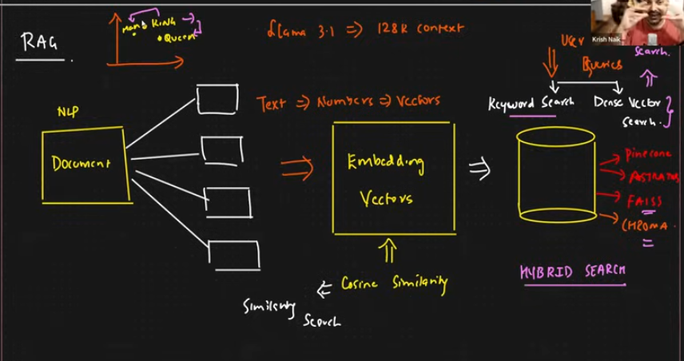
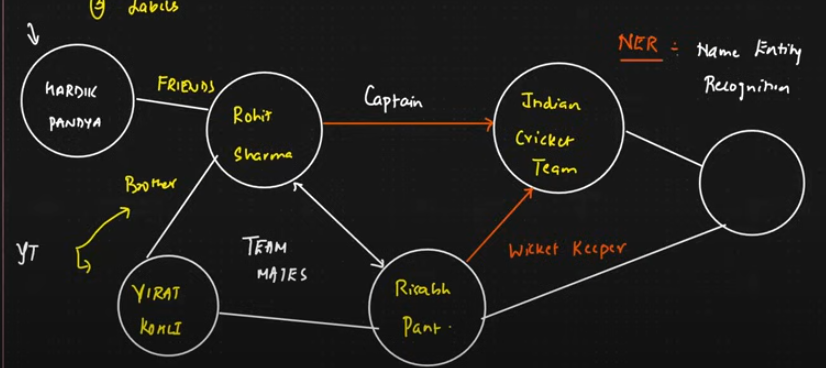
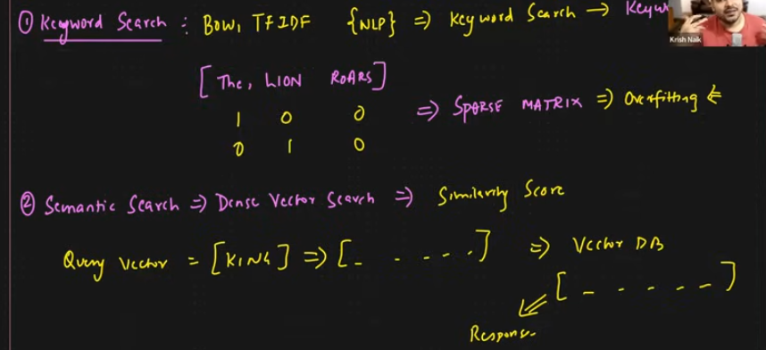
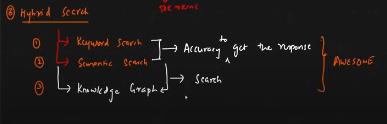
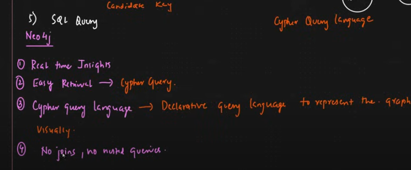
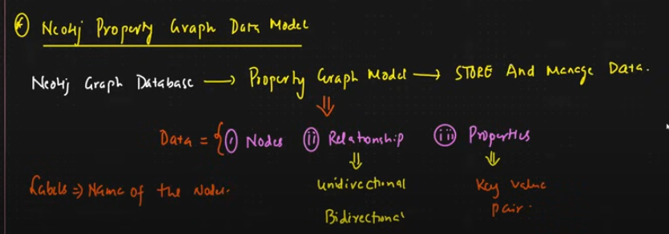

## GraphDB with Langchain

### Agenda
- Knowledge Graph
- Neo4j Graph Database
- Cypher Query Language
- GraphDB with Langchain

## ScreenShots








### Knowledge Graph
- **Definition**: A knowledge graph formally represents semantics by describing entities and their relationships.
- **Ontology**: May utilize ontologies as a schema layer, allowing logical inference for retrieving implicit knowledge.
- **Examples of Relationships**:
  - Rohit Sharma is the captain of the Indian Cricket Team.
  - Rishab Pant is the keeper of the Indian Cricket Team.

- **Components of Knowledge**:
  - **Nodes**: Any objects, places, or persons.
  - **Edges**: Define the relationships between the nodes.
  - **Labels**: Categorize nodes.

### Neo4j Auradb
- **Overview**: Neo4j is a graph database designed to handle large amounts of data and scale horizontally.
- **Type**: NoSQL database using a graph data model to store data.

- **Credentials**:
  - User: <provide_your_username>
  - Password: <your_password>
  - Host: <your_host_id>

### RDBMS vs GraphDB
- Reference: [Graph Database vs Relational Database](https://memgraph.com/blog/graph-database-vs-relational-database)

### Cypher Query Examples
- **Create Nodes**:
  ```cypher
  CREATE (Krish:Person {name: "Krish Naik", born: 1989})
  CREATE (Robert:Person {name: "Robert Downy Jr", born: 1970})
  CREATE (Prabhas:Person {name: "Prabhas", born: 1980})
  ```

- **Create Relationships Between Nodes**:
  ```cypher
  CREATE (Kalki:Movie {title: "Kalki", released: 2024})
  CREATE (IronMan:Movie {title: "IronMan", released: 2008})

  MATCH (Robert:Person {name: "Robert Downy Jr"}), (IronMan:Movie {title: "IronMan"}) 
  CREATE (Robert)-[:ACTED_IN]->(IronMan);

  MATCH (Prabhas:Person {name: "Prabhas"}), (Kalki:Movie {title: "Kalki"}) 
  CREATE (Prabhas)-[:ACTED_IN]->(Kalki);
  ```

### Additional Resources
- Open Google Colab
- Write the code, check my GitHub repository: [View Code](https://github.com/SaiKumarSeela/Explored-GenAI)
- Watch this video for a step-by-step guide: [YouTube Video](https://youtu.be/hsOJhs3_UCM?si=tvb9gNx9T9AaKkRc)