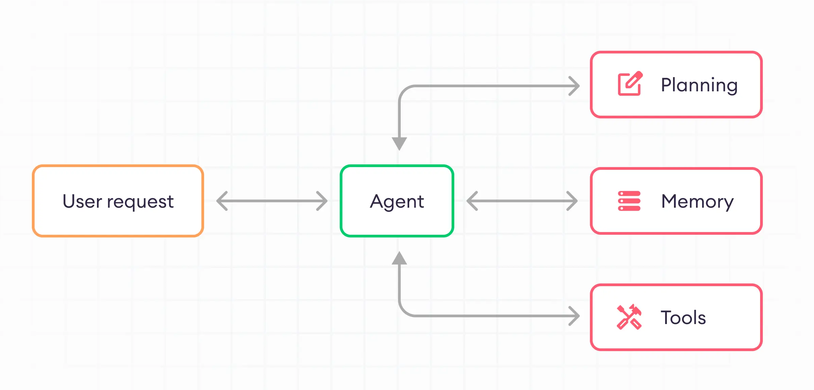

# LLM Agents

## Overview
LLM (Large Language Model) agents are AI systems that use large language models as their core reasoning engine, combined with additional components to interact with the environment and perform tasks.

## Applications
- Personal assistants
- Customer service chatbots
- Research and analysis tools
- Code generation and debugging
- Content creation and editing
- Task automation and workflow optimization

## Advantages
1. Flexibility: Can handle a wide range of tasks and domains
2. Natural language interaction: Easy for humans to communicate with
3. Continuous learning: Can be updated with new information
4. Problem-solving capabilities: Can break down complex tasks
5. Integration potential: Can work with various tools and APIs

## LLM Agent Framework

### 1. Memory
- Short-term memory: Keeps track of recent interactions
- Long-term memory: Stores important information for future use
- Episodic memory: Recalls specific experiences or examples

### 2. Planning
- Goal decomposition: Breaks down complex tasks into subtasks
- Strategy formulation: Develops approaches to achieve goals
- Adaptive planning: Adjusts plans based on new information or obstacles

### 3. Tools
- API integration: Connects to external services and databases
- Function calling: Executes specific functions or scripts
- Web browsing: Searches and retrieves information from the internet
- File manipulation: Reads, writes, and modifies files

By combining these components, LLM agents can perform complex tasks, reason about problems, and interact with their environment in sophisticated ways.

For More information, Check : [LLM Agent Roadmap by Aishwarya Naresh Reganti](https://github.com/aishwaryanr/awesome-generative-ai-guide/blob/main/resources/agents_roadmap.md)