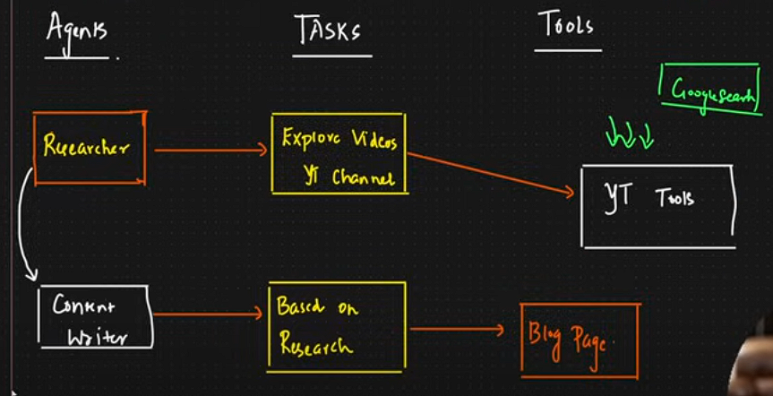

## Exploring crewAI and Multi-Agent Systems: A Comprehensive Overview

In the rapidly evolving landscape of artificial intelligence, two concepts stand out for their transformative potential: **crewAI** and **multi-agent systems**. Both represent significant advancements in how AI can be applied across various sectors, enhancing collaboration, efficiency, and problem-solving capabilities.

### ****What is crewAI?****

**crewAI** is a collaborative framework designed to enable multiple artificial intelligence agents to work together seamlessly. This system emphasizes teamwork and modularity, allowing agents to take on specific roles akin to a human team composed of specialists, such as researchers, writers, and planners. The primary goal of crewAI is to tackle complex tasks by leveraging the strengths of diverse agents, thereby enhancing overall capabilities and decision-making processes.

#### **Key Features of crewAI:**

- **Role-Based Agents:** Each agent is assigned a specific function, promoting specialization and efficiency.
- **Team Collaboration:** Agents communicate and share information, facilitating a cooperative approach to problem-solving.
- **Modular Design:** The framework's structure supports flexibility and adaptability, making it suitable for various applications, from content creation to automated workflows.

crewAI stands out in comparison to other frameworks like AutoGen and ChatDev by combining their strengths while simplifying the orchestration of agent interactions. This flexibility allows for dynamic and adaptable environments, crucial for real-world applications[1][4][6].

### ****Understanding Multi-Agent Systems****

**Multi-agent systems (MAS)** consist of multiple autonomous agents that interact within a shared environment to achieve common or conflicting goals. This approach has gained traction due to its ability to address complex problems that single-agent systems struggle with. The agents in a MAS can possess diverse capabilities, such as language processing, decision-making, and task execution, which can be coordinated to enhance performance.

#### **Core Components of Multi-Agent Systems:**

- **Autonomy:** Each agent operates independently, making decisions based on its objectives and the information available.
- **Communication:** Effective communication protocols are essential for agents to share knowledge and coordinate actions.
- **Coordination Strategies:** Agents must work together to optimize outcomes, which can involve negotiation, collaboration, or competition.

Multi-agent systems are particularly effective for tasks requiring multi-step reasoning, logic, and complex decision-making, such as supply chain management, automated trading, and autonomous driving[2][3][7].

### ****The Intersection of crewAI and Multi-Agent Systems****

crewAI embodies the principles of multi-agent systems by facilitating collaboration among various AI agents. Its design allows for the integration of different agent types, each contributing unique capabilities to a shared objective. This synergy is crucial for addressing complex challenges that require diverse skill sets and perspectives.

#### **Advantages of Combining crewAI with Multi-Agent Approaches:**

- **Enhanced Problem Solving:** By leveraging the strengths of multiple agents, crewAI can tackle intricate tasks more effectively than single-agent systems.
- **Improved Efficiency:** The modular nature of crewAI allows for streamlined processes, reducing redundancy and optimizing resource use.
- **Scalability:** As needs evolve, new agents can be integrated into the crewAI framework without disrupting existing workflows.

### ****Applications and Future Prospects****

The applications of crewAI and multi-agent systems are vast and varied, spanning industries such as healthcare, education, finance, and logistics. Some notable use cases include:

- **Healthcare:** Automating patient data analysis and management through collaborative agents that specialize in different aspects of healthcare delivery.
- **Education:** Creating personalized learning experiences by deploying agents that adapt to individual student needs and learning styles.
- **Finance:** Enhancing trading strategies through agents that analyze market trends and execute trades based on real-time data.

Looking ahead, the future of crewAI and multi-agent systems appears promising. As AI technology continues to advance, these frameworks will likely evolve, incorporating more sophisticated algorithms and capabilities. The ongoing research into multi-agent coordination and communication will further refine these systems, making them more effective and user-friendly.

To Create Multi AI Agent For Complex Usecases: [Watch this video](https://www.youtube.com/watch?v=UV81LAb3x2g)